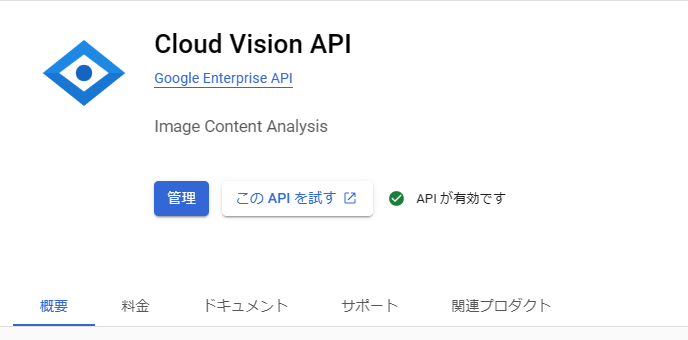

# 目次
- [検証対象のOCR](#try-use-ocr)
  - [Tesseract](#tesseract)
  - [VisionAPI](#visionapi)
  - [Amazon Rekognition](#aws)
- [構築方法](#for-build)
- [その他](#others)
  - [参考サイト](#reference)

---

<a id="try-use-ocr"></a>

## 使ってみたOCR

<a id="tesseract"></a>

### Tesseract
- オープンソース
- 処理は自サーバー（PC）で行う。
- 自分でトレーニングさせることもできる。
- 無料で使うことができる。
- 入力する画像をOCR用に前処理する必要がある。
  - heightが20px以上
  - 回転や傾きの修正
  - 明るさをハイパスフィルター（ローカットフィルター）させる必要がある。

<a id="visionapi"></a>

### VisionAPI
- Googleが提供している。（https://cloud.google.com/vision?hl=ja ）
- 使うためにはGoogleアカウントが必要。
- WebAPIであり、処理はGoogle側で行ってくれる。
- 最初の1000回/月までは無料で使える。
- それ以降は、使う機能によって料金が異なる。（https://cloud.google.com/vision/pricing?hl=ja ）
- 今回使ったのは、画像からテキストを抽出するVisionAPIの機能。（https://cloud.google.com/vision/docs?hl=ja ）


<a id="aws"></a>

### （未検証）Amazon Rekognition
---

<a id="for-build"></a>

# 構築方法
### Tesseract
- pom.xmlに下記の依存関係を追加
```xml
		<dependency>
			<groupId>net.sourceforge.tess4j</groupId>
			<artifactId>tess4j</artifactId>
			<version>4.5.4</version>
		</dependency>
```
- トレーニング用のデータをGithubからダウンロード。
- 環境変数にトレーニングデータの格納パスを設定


### VisionAPI
- pom.xmlに依存関係を追加
```xml
		<dependency>
			<groupId>com.google.cloud</groupId>
			<artifactId>google-cloud-vision</artifactId>
			<version>1.49.0</version>
		</dependency>
```
- GCPのコンソールでVisionAPIを有効にする

- GCPのコンソールから認証情報をダウンロードし、環境変数に設定
  - ここを参考にダウンロード(https://www.ipentec.com/document/software-google-cloud-platform-get-service-account-key )
  - 手順としては、
    1. サービスアカウント画面を開く。
    2. メールの列にあるリンクをクリック。
    3. キータブを選択。
    4. 鍵を追加 ボタンをクリック。
    5. 新しい鍵を作成をクリック。

---

<a id="others"></a>

# その他


